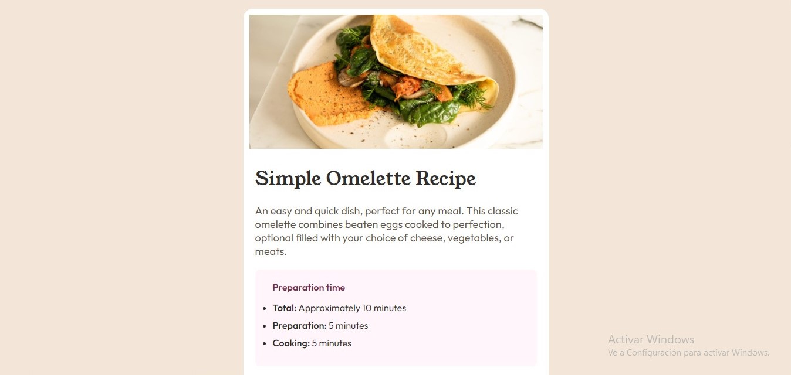

# Recetario 🍲
**En este desafío me concentre en escribir HTML semántico. Asegurandome de pensar qué elementos HTML son los más apropiados para cada contenido.**

**El desafio de este proyecto consistio en  construir esta página de recetas y hacer que se parezca lo más posible al diseño que se da en los deasfios de FrontendMentor.**

## Link
**https://leonardo291024.github.io/Recetario/**

